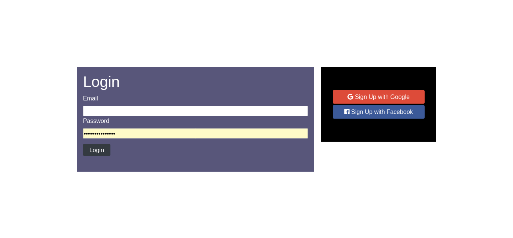

# Social Networking App

Sideland : **## Social Networking Application**

> ### Overview :

- Don't keep those, share your thoughts and connect with amazing people. Life can just be burden, open some gates to your world and meets people extraordinary like you. You might understand that your world lead to your guests friends you take steps to invite.
- This App made us learn about bases of MongoDataBases and security to implement registration through a website.

## Interest

You might be interested on how:

- to implement a securing app where users can **login** or **logout** safely using their credentials accounts

- to not only use **npm package** to just start and build react app (npm start, npm run build), your choices can lead you to discover cool modules of `NodeJS` under **npm packages** as `express`, `ejs`, `md5`, `bcrypt` to help you build an ended trust and secure website.

### Links

- Solution URL: [https://github.com/BeinRain06/social-networking-app.git](https://github.com/BeinRain06/todo-list-app.git)
- Live Site URL: [https://beinrain06.github.io/social-networking-app/](https://beinrain06.github.io/todo-list-app/)

## Description : \* challenge issue

- i have had a harsh time when trying to connect the **MongoDB database** with **NodeJs** to lunch my app. It was the first time dealing with mongodb.
- I got many errors like :

  - `error: mongonetworkerror: connect econnrefused 127.0.0.1:27017`
  - `Unit mongod.service not found`
  - `unit mongod.service does not exist, proceeding anyway.`

And effectively in my case it was not a bug as:

> MongoDB was not by default actived to start
> MongoDB is masked
> It was really the fact that i don't **create properly the database** but use an **existential base of one another**

Hopefully i come upon this great tutorial of **Arpane Neupane** on youtube about _how to connect MongoDB with NodeJS and start Node Application_ , i follow the example an it works.

- **Serialization/Deserialization**

  - This topic was quite one serious for me , i got my head crashing between 1 half and 2 weeks when bumps into several error blowed by my **console app** that i think it's relevant to take times to talk about it.
    >
  - **why do we need Serialization/Deserialization?**

    > | mordern language need to store and work with any form of data. For instance `object data` can be stored in **JSON** or **BSON** file . Because human and programming languages doesn't yet deal in the same language we need each time we want to store data (in a file, in a memory card, in a database, ...) to do so by converting it another kind of data storable in our database for example this process is **Serialization** . ANd when we fetch or call these data to our browse it need to be send back to what it was originally. That it is **Deserialization**

    > | we don't often by now **hearing** about _serialization/deserialization_ because many modern languages deal with some predefined configuration of these process to gently allow us to write code . But if you want to deal with security for your app and your users you need to know about **serialization** and **deserialization** as well as if you want to know more about storing data properly in **back-end development**

- **security**
  > | my app is an entertainment and first was made to understand some concepts of security (the 06 layers of security) , it's not strongly secure. Please indulge myself, this is my first time . I would like to improve the step of security from future app . Hope that makes sense to you and let's keep doing amazing stuff guys. Thanks You!

## CSS Structures:

> - <App/> main component connect to node handle all the javascript need to display all our **related webpages** ,

> five main ejs files (helps write in HTML and CSS in the `ǸodeJS` environment):
> -home.ejs, login.ejs, register.ejs, secrets.ejs, submit.ejs

**Picture**

---

---

---

---

# What I learned

### Securing An App

All App need to ensure security to their users. Securing an app is all about six majors steps, the **six layers** of **security** :

**1.Create a Database Documents with MongoDB, SQL, Tableu...**

**2.Encrypt**

> Sometimes in a project some information as password, location, card number need to be hided from others users or even the staff under the creation of the application. To do so we first change input text **values** concerned into some others **strings and alpha-numeric characters** that only the website will remember instead of what has been written by users. This is **encryption**.

**3.Create an Environmemt Variable**

> When coding our app some part of code or functions at times need have an access to our **sensitive data**. In a such a case deal vulnerabilities are still seen. For example if someone browse the console of our apps they could lead to our sensitive data easily. To avoid that we really do, need to **create an anvironmemt variable** > **Environment variable** is a file into our project that encompasses inside **sensitive data** using an **alias name**
>
> It is this `alias name` that will be called each time you need the referenced sensitive data.

**4.Hashing and Salting**

> Hashing and salting increase the level of **encryption**

- **Hashing** is about taking an _*encrypted* data_ and apply a **hash function** to generate new random characters using cryptogarphy, or others method to build something called **hash** that represents the _*encrypted* data_ given.
- e.g: **passord encrypted** ---> **Hash Function** ---> **Hash Value**

- **Salting** is about lenghten an _*encrypted* data_ with generated random characters and alpha numeric to strength the difficulty to access this _*encrypted* data_. More an _*encrypted* data_ is lengthen , more is secure. We can **salt** an encrypted value more than one time. This process is called **salt round**

**5.COOKIES AND SESSIONS**

- **COOKIES** are data stored about activities of a users during a **session** to a better experience of the website sharped through all his researches and interests. A session end when the users **logout** of the website. Cookies are **deleted** each time a session end. \*\*Cookies\*\ are also part to protect (to configure in your app) for security of users.

- **SESSIONS** are period of times where our **browser** interacts with the **server**.This period `end` when you log out of a wensite and `restart`when you log in again. \*\*Session Data\*\ need also to be **secured**

**6.Google oAuth or others**

-This level use the **security** requiring accessing an secure account created by user at **Google**, **Facebook** or another brand , to grant user and redirect this former the webpage link corresponding from the website.

### passportjs.org

This website is a newly discover, comes to think about it , it has severals packages that functions interact with server and achieves bunch of features.
Good one to explore
In our project we use the **pasport-google-oauth** package to well achieve **login/logout** in our webpage.

### npmjs.com

This website deals with node packages manager (npm) from `ǸodeJS`. We have implemented packages like: body-parser, bcrypt, ejs, findOrCreate, express

### utilities Materials:

    -ejs of NPM Package (npmjs.com)
    -MonGoDB
    -Google oAuth (console.google.cloud.com)
    -passportsjs.org (login and logout implementation with oAuth google)

### Mobile Responsiveness

    - Mobile reponsiveness for mobile max-width: 320px ,max-width: 626px,

**Picture**

---

---

---

---

## Callback History:

- NodeJS started with **_Ryan Dahl_** in the year **2009** .The project development was distributed by **Node.js Foundation** that becomes now **openJSFoundation** under Linux Collaborative foundation Program.
- NodeJS is a **back-end javascrypt runtime environment** . That simply means it helps us run javascript out of our local browser in an environment that allows **users** to have **dynamics response** sharped to their **queries requirements or access right**. These responses comes from our **\*Server-side** environment (web server) depending on our location. With `ǸodeJS`we can also runs command line with `ǹpm manager` to extend and install modules we need for customization into our project.
- Remember we have two side:
  - `client-side environment` , usually our local **browser**
  - `server-side environment` , representing **web server**
  - `NodeJS` , is a **_back-end environment_** that link **client-side environment** and **server-side environment** allowing dynamic pages rendering, and customize access most effectively with **javascript** all that in a single language of your choice (react, vue, angular, ...)

## Useful Resources :

- Arpan Neupane (youtube) : ['how to connect Node.js App to MongoDB'](https://www.youtube.com/watch?v=bhiEJW5poHU&t=608s) : this link stands very relevant for me . It's give me a ligth star how to **create my first data base with mongoDB** and connect it to **node.js** in such kind to be able to launch my app via `NodeJS` environment.

- computerScience : ['https://computersciencewiki.org/index.php/Client-side_scripting_and_server-side_scripting'](https://computersciencewiki.org/index.php/Client-side_scripting_and_server-side_scripting) : helps me quickly learn about **client-side environment** (browser) and **server side environment** (web server)

- StackOverflow : ['alternative to findById using passport in nodejs authentication?'](https://stackoverflow.com/questions/25614863/alternative-to-findbyid-using-passport-in-nodejs-authentication) : stackoverflow article and answers are always great i have struggled with `serializer` and `deserializer` method since Id of each _users_ of my mongoDB Document unfortunately changes after each process of serialiwation and deserialization. What makes impossible to find user by Id. Have to figure out another plan to do it.

- makeuseof.com : ['NodeJS Google Authentication Using Passport and Express'](https://www.makeuseof.com/nodejs-google-authentication/) : it was enligthening to understand how `passport` module work in **local-strategy**, what's steps to achieves well integration of **passport** to get at redirected **urls** when our app is naturrally coded with **expressjs** module of nodejs and have some work to do fetching data in a backend-environment as our **mongoDB** database.

- makeuseof.com : ['User Authentication in NodeJS Using Passport and MongoDB'](https://www.makeuseof.com/user-authentication-in-nodejs/) : this article was our guide to implement `mongoDB Model`and `passport local strategy`

- DevCommunity: ['https://dev.to/ebereplenty/authentication-with-nodejs-and-mongodb-part-1-10pn'](https://dev.to/ebereplenty/authentication-with-nodejs-and-mongodb-part-1-10pn) : this article give me a hint of how to insert **mongoDB cluster** url in my _app.js_ in node securing my _cluster_ `password`.

- github : ['saintedlama /
  passport-local-mongoose '](https://github.com/saintedlama/passport-local-mongoose) : want to know further about **local-strategy** to authenticate **user access** in your app, using _passport local mongoose_ module - **santedlama** decrypt us in our repository what it is and how to process to plugin and add some cool features via **passport-local-mongoose**

- passportjs.org: ['https://www.passportjs.org/'](https://www.passportjs.org/) : to implement login and logout authorization along with google oauth nd facebook oauth.

- npmjs.com: ['https://www.npmjs.com/'](https://www.npmjs.com/) : to code using **ejs, express** and many others modules of **npm**.

## Acknowledge:

This project always remember the Team :

- Arpane Neupane: helps me figure out how to launch a **node application** with **MongoDB**

- saintedlama: helps us understand globally what we can intend to using `*passport local mongoose*` module of nodejs (_npmjs.com_)

-Sufa Digital: udemy with his explanations about the 6 layers of security when registering or login to an app

- Mary Gathoni : articles written about passport using mongoDB and NodeJS was a great reference to us to that project, can't deal with it if not enlightened by these ones.

_Our Work always remember this team_

## Author

- Frontend Mentor - [https://www.frontendmentor.io/profile/BeinRain06](https://www.frontendmentor.io/profile/BeinRain06)
- Twitter - [https://twitter.com/nest_Ngoueni](https://twitter.com/nest_Ngoueni)
